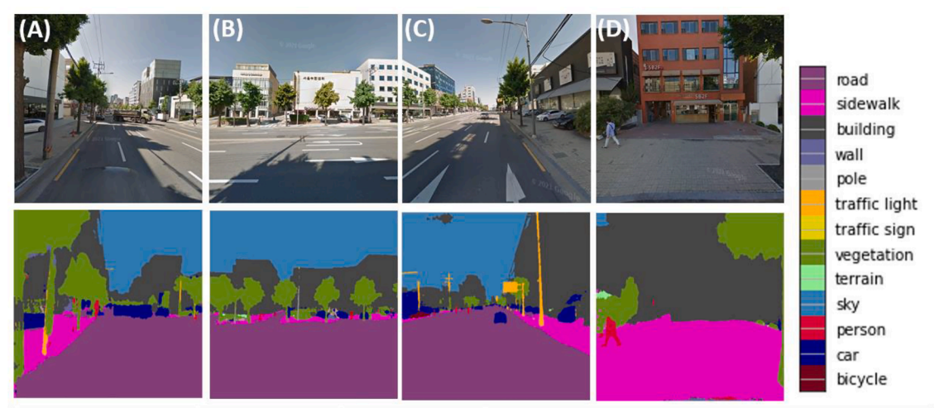

  

<h1>SVI-LLM</h1>

利用LLM对街景图像进行分析，定性描述街景图像，并定量评价街道活力

## 📖 项目概述

通过街道摄像头、卫星影像等方式获取高质量的街景图像，利用计算机视觉和图像处理技术来识别、提取和分析街道场景中的各种信息，可以帮助城市规划者、交通管理部门等对街道活力进行客观评估，为城市发展和管理提供重要参考依据。

## 😊 主要功能

1. **物体检测与识别**：利用物体检测算法，识别图像中的不同物体，如建筑、车辆、行人等。通过识别这些物体，可以对街道的繁华程度进行初步评估。
2. **行人流量分析**：通过检测和跟踪图像中的行人，可以分析不同时间段街道上的行人流量，从而推断街道的活跃程度。
3. **交通流量分析**：利用车辆检测和跟踪技术，分析街道上不同车辆的密度和速度，进而评估街道的交通情况和繁忙程度。
4. **建筑特征提取**：识别并分析街道两侧的建筑物特征，如建筑密度、建筑高度、商铺密集度等，这些特征也能反映街道的活力水平。
5. **环境因素考虑**：除了图像本身的信息，还可以结合一些外部因素，如气候、节假日等，来综合评估街道的活力程度。
6. **数据分析与可视化**：将从图像中提取的各种信息进行数据分析和可视化，生成统计数据、热力图等形式，直观展示街道活力的分布和变化趋势。

## 💼 安装指南

开发ing🧑🏽‍💻

## 📚 使用说明

开发ing🧑🏽‍💻

